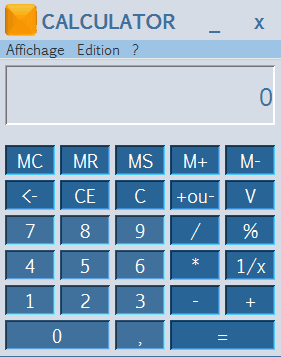

# Java Calculator
Ce projet a été écrit à l'origine en utilisant **un simple éditeur de texte** (Sublime Text 2), mais je l'ai migré vers NetBeans tout en conservant le *hand coding*. Et donc **le backend et le frontend ont été du pur *hand coding***. C'était un travail pratique que j'avais réalisé en Janvier 2016 dans le cours de **Java Standard Edition** et qu'il fallait remettre dans deux semaines.

Cette calculatrice est simple avec un code facile pour aider les novices à apprendre comment créer un programme de calculatrice avec Java.

## Screenshots


## Comment l'utiliser
Il y a deux façons d'exécuter ce projet:
- En lançant le fichier ```Calculator.java```
- En exécutant en ligne de commande ```java -jar Calculator.jar``` (vous devez vous retrouver dans le repertoire principal du projet)

## Communauté
- [ITOT Africa](https://itotafrica.com/)
- [ITOT Africa Forum](https://itotafrica.com/forum)

## Contact
- Say hello : sergekishiko [AT] gmail [DOT] com
- Follow me on twitter : [@s_kishiko](https://twitter.com/s_kishiko)
- Let's be connected : [Serge Kishiko](https://linkedin.com/in/serge-kishiko/)